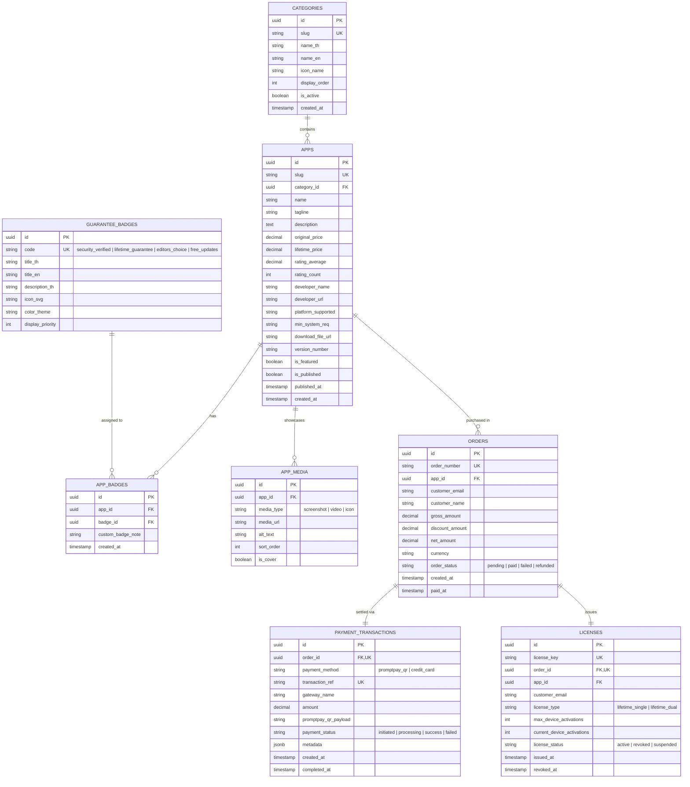

# 🗄️ Database Design Specification (เอกสารการออกแบบฐานข้อมูล)
## แพลตฟอร์มคลังแอปพลิเคชันคัดสรรแบบซื้อขาด (Curated Lifetime App Store)
**โครงการ: MVP กลุ่ม 2**

---

### ข้อมูลเอกสาร (Document Information)
- **รหัสเอกสาร:** DBD-MVP2-001
- **เวอร์ชัน:** 1.0.0
- **วันที่จัดทำ:** 16 สิงหาคม 2026
- **สถานะ:** เสนออนุมัติโครงสร้างฐานข้อมูล (Database Schema Baseline)
- **ผู้จัดทำ:** ทีมพัฒนาโครงการกลุ่ม 2 (MVP Group 2)
- **เอกสารอ้างอิง:** 
  - [Project Charter (PC-MVP2-001)](file:///C:/Users/WIN10/docs/project_charter.md)
  - [Software Requirements Specification (SRS-MVP2-001)](file:///C:/Users/WIN10/docs/requirements_specification.md)
  - [Acceptance Criteria (AC-MVP2-001)](file:///C:/Users/WIN10/docs/acceptance_criteria.md)

---

## 1. วัตถุประสงค์และหลักการออกแบบ (Purpose & Design Principles)

เอกสารฉบับนี้กำหนดโครงสร้างฐานข้อมูล (Database Schema), ความสัมพันธ์ระหว่างเอนทิตี (ER Diagram), พจนานุกรมข้อมูล (Data Dictionary) และดัชนี (Indexes) เพื่อรองรับ 4 ฟังก์ชันหลักของระบบ MVP กลุ่ม 2:
1. **คลังแอปคัดสรรและป้ายการันตี:** รองรับการจัดเก็บข้อมูลแอป สเปก สื่อตัวอย่าง และป้ายรับรองความน่าเชื่อถือ
2. **ระบบคัดกรองและค้นหา:** รองรับการค้นหาด่วนตามคำสำคัญ หมวดหมู่ ป้ายการันตี และช่วงราคา
3. **หน้ารายละเอียดและราคาโปร่งใส:** จัดเก็บข้อมูลราคาซื้อขาดสุทธิ รายการสิ่งที่รวมอยู่ในแพ็กเกจ และเงื่อนไขการรับประกัน
4. **ระบบชำระเงินซื้อขาดและการออก License:** รองรับการบันทึกคำสั่งซื้อ ข้อมูลการชำระเงิน (PromptPay / Card) และการสร้าง License Key ตลอดชีพอย่างปลอดภัย

---

## 2. แผนผังความสัมพันธ์ข้อมูล (Entity-Relationship Diagram: ERD)



---

## 3. พจนานุกรมข้อมูลโดยละเอียด (Detailed Data Dictionary)

---

### 🗂️ 3.1 ตาราง: `categories` (หมวดหมู่ประเภทของแอปพลิเคชัน)
เก็บข้อมูลหมวดหมู่เพื่อรองรับฟังก์ชันการคัดกรองประเภทของแอป (FR-2)

| ชื่อฟิลด์ (Column) | ชนิดข้อมูล (Type) | Nullable | Default | PK/FK/UK | คำอธิบาย (Description) |
|---|---|:---:|---|:---:|---|
| `id` | `UUID` | NO | `gen_random_uuid()` | **PK** | รหัสเฉพาะของหมวดหมู่ |
| `slug` | `VARCHAR(50)` | NO | - | **UK** | URL Slug เช่น `productivity`, `dev-tools` |
| `name_th` | `VARCHAR(100)` | NO | - | - | ชื่อหมวดหมู่ภาษาไทย |
| `name_en` | `VARCHAR(100)` | NO | - | - | ชื่อหมวดหมู่ภาษาอังกฤษ |
| `icon_name` | `VARCHAR(50)` | NO | - | - | ชื่อไอคอน UI เช่น `Briefcase`, `Code` |
| `display_order` | `INTEGER` | NO | `0` | - | ลำดับการแสดงผลบนแถบ Filter |
| `is_active` | `BOOLEAN` | NO | `true` | - | สถานะเปิดใช้งานหมวดหมู่ |
| `created_at` | `TIMESTAMPTZ` | NO | `NOW()` | - | วันที่สร้างข้อมูล |

---

### 🛡️ 3.2 ตาราง: `guarantee_badges` (ป้ายรับรองการันตี)
เก็บข้อมูลประเภทป้ายการันตีความน่าเชื่อถือและความโปร่งใส (FR-1)

| ชื่อฟิลด์ (Column) | ชนิดข้อมูล (Type) | Nullable | Default | PK/FK/UK | คำอธิบาย (Description) |
|---|---|:---:|---|:---:|---|
| `id` | `UUID` | NO | `gen_random_uuid()` | **PK** | รหัสเฉพาะของป้ายการันตี |
| `code` | `VARCHAR(50)` | NO | - | **UK** | รหัสป้าย เช่น `security_verified`, `lifetime_guarantee` |
| `title_th` | `VARCHAR(100)` | NO | - | - | ชื่อป้ายภาษาไทย เช่น "การันตีความปลอดภัย" |
| `title_en` | `VARCHAR(100)` | NO | - | - | ชื่อป้ายภาษาอังกฤษ เช่น "Security Verified" |
| `description_th`| `VARCHAR(255)` | NO | - | - | คำอธิบายรายละเอียดเมื่อ Hover แสดง Tooltip |
| `icon_svg` | `TEXT` | YES | - | - | SVG Path หรือ Icon Class |
| `color_theme` | `VARCHAR(30)` | NO | `'blue'` | - | ธีมสีของป้าย (เช่น `emerald`, `amber`, `indigo`) |
| `display_priority`| `INTEGER` | NO | `1` | - | ลำดับความสำคัญในการจัดเรียงป้าย |

---

### 📱 3.3 ตาราง: `apps` (ตารางหลักคลังแอปพลิเคชัน)
เก็บข้อมูลรายละเอียดแอปพลิเคชัน ราคาซื้อขาด และข้อมูลสเปก (FR-1, FR-3)

| ชื่อฟิลด์ (Column) | ชนิดข้อมูล (Type) | Nullable | Default | PK/FK/UK | คำอธิบาย (Description) |
|---|---|:---:|---|:---:|---|
| `id` | `UUID` | NO | `gen_random_uuid()` | **PK** | รหัสเฉพาะของแอปพลิเคชัน |
| `slug` | `VARCHAR(100)` | NO | - | **UK** | URL Slug สำหรับเปิดหน้า App Detail |
| `category_id` | `UUID` | NO | - | **FK** | อ้างอิง `categories(id)` |
| `name` | `VARCHAR(150)` | NO | - | - | ชื่อแอปพลิเคชัน |
| `tagline` | `VARCHAR(255)` | NO | - | - | คำโปรยสั้นแสดงบนการ์ด |
| `description` | `TEXT` | NO | - | - | คำอธิบายฟังก์ชันและฟีเจอร์อย่างละเอียด |
| `original_price`| `DECIMAL(10,2)`| NO | - | - | ราคาตั้งต้นก่อนลด (สำหรับแสดงขีดฆ่า) |
| `lifetime_price`| `DECIMAL(10,2)`| NO | - | - | **ราคาซื้อขาดสุทธิ (Net Lifetime Price)** |
| `rating_average`| `DECIMAL(3,2)` | NO | `5.00` | - | คะแนนรีวิวเฉลี่ย (0.00 - 5.00) |
| `rating_count` | `INTEGER` | NO | `0` | - | จำนวนผู้รีวิว |
| `developer_name`| `VARCHAR(100)` | NO | - | - | ชื่อผู้พัฒนาหรือสตูดิโอ |
| `developer_url` | `VARCHAR(255)` | YES | - | - | เว็บไซต์ของผู้พัฒนา |
| `platform_supported`| `VARCHAR(100)` | NO | `'Windows / macOS'` | - | ระบบปฏิบัติการที่รองรับ |
| `min_system_req`| `TEXT` | YES | - | - | ความต้องการขั้นต่ำของระบบ (RAM, CPU, Disk) |
| `download_file_url` | `VARCHAR(500)` | NO | - | - | ลิงก์ดาวน์โหลดตัวติดตั้งโปรแกรม |
| `version_number`| `VARCHAR(30)` | NO | `'1.0.0'` | - | เลขเวอร์ชันปัจจุบัน |
| `is_featured` | `BOOLEAN` | NO | `false` | - | สถานะไฮไลต์ใน Hero Section |
| `is_published` | `BOOLEAN` | NO | `true` | - | สถานะเผยแพร่บนหน้าร้าน |
| `created_at` | `TIMESTAMPTZ` | NO | `NOW()` | - | วันที่เพิ่มแอปเข้าสู่ระบบ |

---

### 🔗 3.4 ตาราง: `app_badges` (ตารางเชื่อมโยงแอปกับป้ายการันตี)
เก็บความสัมพันธ์แบบ Many-to-Many ระหว่าง Apps และ Guarantee Badges

| ชื่อฟิลด์ (Column) | ชนิดข้อมูล (Type) | Nullable | Default | PK/FK/UK | คำอธิบาย (Description) |
|---|---|:---:|---|:---:|---|
| `id` | `UUID` | NO | `gen_random_uuid()` | **PK** | รหัสเฉพาะ |
| `app_id` | `UUID` | NO | - | **FK** | อ้างอิง `apps(id)` ON DELETE CASCADE |
| `badge_id` | `UUID` | NO | - | **FK** | อ้างอิง `guarantee_badges(id)` |
| `custom_badge_note`| `VARCHAR(100)` | YES | - | - | ข้อความกำกับเพิ่มเติมเฉพาะแอป |
| `created_at` | `TIMESTAMPTZ` | NO | `NOW()` | - | วันที่ผูกป้ายการันตี |

*Unique Constraint: `UNIQUE(app_id, badge_id)`*

---

### 🖼️ 3.5 ตาราง: `app_media` (รูปภาพและสื่อตัวอย่าง)
เก็บภาพหน้าจอ วิดีโอเดโม และไอคอนความละเอียดสูงของแอป (FR-3)

| ชื่อฟิลด์ (Column) | ชนิดข้อมูล (Type) | Nullable | Default | PK/FK/UK | คำอธิบาย (Description) |
|---|---|:---:|---|:---:|---|
| `id` | `UUID` | NO | `gen_random_uuid()` | **PK** | รหัสสื่อ |
| `app_id` | `UUID` | NO | - | **FK** | อ้างอิง `apps(id)` ON DELETE CASCADE |
| `media_type` | `VARCHAR(20)` | NO | `'screenshot'` | - | ประเภทสื่อ: `icon`, `screenshot`, `video` |
| `media_url` | `VARCHAR(500)` | NO | - | - | URL ที่อยู่ของไฟล์ภาพหรือวิดีโอ |
| `alt_text` | `VARCHAR(150)` | YES | - | - | ข้อความอธิบายภาพ (SEO / Accessibility) |
| `sort_order` | `INTEGER` | NO | `0` | - | ลำดับการแสดงใน Slider/Gallery |
| `is_cover` | `BOOLEAN` | NO | `false` | - | เป็นภาพปกหลักหรือไม่ |

---

### 🛒 3.6 ตาราง: `orders` (รายการสั่งซื้อซื้อขาด)
เก็บบันทึกข้อมูลการสั่งซื้อ ความโปร่งใสของราคา และข้อมูลผู้ซื้อ (FR-4)

| ชื่อฟิลด์ (Column) | ชนิดข้อมูล (Type) | Nullable | Default | PK/FK/UK | คำอธิบาย (Description) |
|---|---|:---:|---|:---:|---|
| `id` | `UUID` | NO | `gen_random_uuid()` | **PK** | รหัสเฉพาะของคำสั่งซื้อ |
| `order_number` | `VARCHAR(30)` | NO | - | **UK** | รหัสเลขอ้างอิงคำสั่งซื้อ เช่น `ORD-20260816-8921` |
| `app_id` | `UUID` | NO | - | **FK** | อ้างอิง `apps(id)` |
| `customer_email`| `VARCHAR(255)` | NO | - | - | อีเมลผู้ซื้อสำหรับรับ License และใบเสร็จ |
| `customer_name` | `VARCHAR(150)` | NO | - | - | ชื่อผู้ซื้อ / ชื่อผู้ถือสิทธิ์ |
| `gross_amount` | `DECIMAL(10,2)`| NO | - | - | ยอดราคาเต็มก่อนหักส่วนลด |
| `discount_amount`| `DECIMAL(10,2)`| NO | `0.00` | - | ส่วนลดที่ได้รับ |
| `net_amount` | `DECIMAL(10,2)`| NO | - | - | **ยอดชำระสุทธิ (ตรงตามหน้าแอป 100%)** |
| `currency` | `VARCHAR(3)` | NO | `'THB'` | - | สกุลเงิน (บาท) |
| `order_status` | `VARCHAR(20)` | NO | `'pending'` | - | สถานะ: `pending`, `paid`, `failed`, `refunded` |
| `created_at` | `TIMESTAMPTZ` | NO | `NOW()` | - | วันเวลาที่เริ่มทำรายการ |
| `paid_at` | `TIMESTAMPTZ` | YES | - | - | วันเวลาที่ชำระเงินสำเร็จ |

---

### 💳 3.7 ตาราง: `payment_transactions` (ข้อมูลการทำธุรกรรมชำระเงิน)
เก็บบันทึกการชำระเงินผ่าน PromptPay QR หรือ Credit Card (FR-4)

| ชื่อฟิลด์ (Column) | ชนิดข้อมูล (Type) | Nullable | Default | PK/FK/UK | คำอธิบาย (Description) |
|---|---|:---:|---|:---:|---|
| `id` | `UUID` | NO | `gen_random_uuid()` | **PK** | รหัสเฉพาะของธุรกรรม |
| `order_id` | `UUID` | NO | - | **FK, UK** | อ้างอิง `orders(id)` |
| `payment_method`| `VARCHAR(30)` | NO | - | - | ช่องทางชำระเงิน: `promptpay_qr`, `credit_card` |
| `transaction_ref`| `VARCHAR(100)` | YES | - | **UK** | รหัสอ้างอิงจาก Payment Gateway |
| `gateway_name` | `VARCHAR(50)` | NO | `'PromptPay-Direct'` | - | ผู้ให้บริการเกตเวย์ |
| `amount` | `DECIMAL(10,2)`| NO | - | - | จำนวนเงินที่ทำรายการ |
| `promptpay_qr_payload`| `TEXT` | YES | - | - | Payload String สำหรับสร้างรูป QR Code |
| `payment_status`| `VARCHAR(20)` | NO | `'initiated'`| - | สถานะ: `initiated`, `processing`, `success`, `failed` |
| `metadata` | `JSONB` | YES | `'{}'` | - | ข้อมูลเสริม (เช่น masking card no, IP address) |
| `created_at` | `TIMESTAMPTZ` | NO | `NOW()` | - | เวลาเริ่มทำธุรกรรม |
| `completed_at` | `TIMESTAMPTZ` | YES | - | - | เวลาที่ธุรกรรมสำเร็จสมบูรณ์ |

---

### 🔑 3.8 ตาราง: `licenses` (สิทธิ์การใช้งานตลอดชีพ / License Key)
เก็บบันทึก License Key ที่ออกให้กับผู้ซื้อสำหรับการเปิดใช้งานโปรแกรมแบบถาวร (FR-4)

| ชื่อฟิลด์ (Column) | ชนิดข้อมูล (Type) | Nullable | Default | PK/FK/UK | คำอธิบาย (Description) |
|---|---|:---:|---|:---:|---|
| `id` | `UUID` | NO | `gen_random_uuid()` | **PK** | รหัสเฉพาะของสิทธิ์ |
| `license_key` | `VARCHAR(64)` | NO | - | **UK** | รหัสคีย์เฉพาะ เช่น `LF-PROD-9A7B-4F2C-8E1D` |
| `order_id` | `UUID` | NO | - | **FK, UK** | อ้างอิง `orders(id)` |
| `app_id` | `UUID` | NO | - | **FK** | อ้างอิง `apps(id)` |
| `customer_email`| `VARCHAR(255)` | NO | - | - | อีเมลที่ผูกสิทธิ์การใช้งาน |
| `license_type` | `VARCHAR(30)` | NO | `'lifetime_dual'` | - | ประเภทสิทธิ์ (เช่น ใช้งานได้ 2 อุปกรณ์ตลอดชีพ) |
| `max_device_activations` | `INTEGER` | NO | `2` | - | จำนวนเครื่องสูงสุดที่สามารถเปิดใช้งานพร้อมกัน |
| `current_device_activations` | `INTEGER` | NO | `0` | - | จำนวนเครื่องที่เปิดใช้งานอยู่ในปัจจุบัน |
| `license_status`| `VARCHAR(20)` | NO | `'active'` | - | สถานะสิทธิ์: `active`, `revoked`, `suspended` |
| `issued_at` | `TIMESTAMPTZ` | NO | `NOW()` | - | วันเวลาที่ออกสิทธิ์ |
| `revoked_at` | `TIMESTAMPTZ` | YES | - | - | วันเวลาที่ยกเลิกสิทธิ์ (ถ้ามี) |

---

## 4. การออกแบบดัชนีเพื่อประสิทธิภาพ (Database Indexes)

เพื่อรองรับฟังก์ชันค้นหาและคัดกรองแบบ Real-time ตามความต้องการใน SRS (Response Time < 200ms) มีการกำหนด Indexes ดังนี้:

```sql
-- 1. ค้นหาและกรองตามหมวดหมู่ และสถานะเผยแพร่
CREATE INDEX idx_apps_category_published ON apps(category_id, is_published);

-- 2. ค้นหาและเรียงลำดับตามราคาซื้อขาด (Sorting Low-High / High-Low)
CREATE INDEX idx_apps_lifetime_price ON apps(lifetime_price);

-- 3. ค้นหาตามความนิยมและเรตติ้ง (Sorting Most Popular)
CREATE INDEX idx_apps_rating ON apps(rating_average DESC, rating_count DESC);

-- 4. ค้นหาชื่อและคำโปรยด้วย Full-Text Search
CREATE INDEX idx_apps_search ON apps USING gin(to_tsvector('simple', name || ' ' || tagline));

-- 5. ตรวจสอบ License Key และค้นหาตามอีเมลผู้ซื้อ
CREATE INDEX idx_licenses_lookup ON licenses(license_key, customer_email);
CREATE INDEX idx_orders_customer_email ON orders(customer_email);
```

---

## 5. ข้อมูลจำลองตั้งต้นสำหรับ MVP (Seed Data Preview)

### 5.1 ตัวอย่างหมวดหมู่ (`categories`)
```json
[
  { "slug": "productivity", "name_th": "เพิ่มผลผลิต & งานเอกสาร", "name_en": "Productivity", "icon_name": "Sparkles", "display_order": 1 },
  { "slug": "dev-tools", "name_th": "เครื่องมือนักพัฒนา", "name_en": "Developer Tools", "icon_name": "Code2", "display_order": 2 },
  { "slug": "design-media", "name_th": "กราฟิก & ตัดต่อวิดีโอ", "name_en": "Design & Media", "icon_name": "Palette", "display_order": 3 },
  { "slug": "utilities", "name_th": "เครื่องมือดูแลระบบ", "name_en": "Utilities", "icon_name": "Wrench", "display_order": 4 },
  { "slug": "business", "name_th": "ธุรกิจ & การเงิน", "name_en": "Business & Finance", "icon_name": "TrendingUp", "display_order": 5 }
]
```

### 5.2 ตัวอย่างป้ายการันตี (`guarantee_badges`)
```json
[
  { "code": "security_verified", "title_th": "การันตีความปลอดภัย", "description_th": "ผ่านการสแกนความปลอดภัย ไร้มัลแวร์และมัลแวร์แฝง 100%", "color_theme": "emerald" },
  { "code": "lifetime_guarantee", "title_th": "สิทธิ์ตลอดชีพแท้จริง", "description_th": "ซื้อครั้งเดียวจบ ใช้งานได้ตลอดไป ไม่มีวันหมดอายุหรือเรียกเก็บซ้ำ", "color_theme": "amber" },
  { "code": "editors_choice", "title_th": "แอปยอดเยี่ยมคัดสรร", "description_th": "ผ่านการทดสอบมาตรฐานความเสถียรและความคุ้มค่าโดยทีมงาน", "color_theme": "indigo" },
  { "code": "free_updates", "title_th": "อัปเดตฟรีตลอดชีพ", "description_th": "การันตีได้รับ Patch ความปลอดภัยและฟีเจอร์เวอร์ชันถัดไปฟรี", "color_theme": "cyan" }
]
```

---

## 6. คำสั่ง SQL DDL สำหรับสร้างฐานข้อมูลจริง (PostgreSQL DDL Migration)

```sql
-- เปิดส่วนขยายสร้าง UUID
CREATE EXTENSION IF NOT EXISTS "uuid-ossp";

-- 1. Table: categories
CREATE TABLE categories (
    id UUID PRIMARY KEY DEFAULT uuid_generate_v4(),
    slug VARCHAR(50) NOT NULL UNIQUE,
    name_th VARCHAR(100) NOT NULL,
    name_en VARCHAR(100) NOT NULL,
    icon_name VARCHAR(50) NOT NULL,
    display_order INTEGER NOT NULL DEFAULT 0,
    is_active BOOLEAN NOT NULL DEFAULT true,
    created_at TIMESTAMPTZ NOT NULL DEFAULT NOW()
);

-- 2. Table: guarantee_badges
CREATE TABLE guarantee_badges (
    id UUID PRIMARY KEY DEFAULT uuid_generate_v4(),
    code VARCHAR(50) NOT NULL UNIQUE,
    title_th VARCHAR(100) NOT NULL,
    title_en VARCHAR(100) NOT NULL,
    description_th VARCHAR(255) NOT NULL,
    icon_svg TEXT,
    color_theme VARCHAR(30) NOT NULL DEFAULT 'blue',
    display_priority INTEGER NOT NULL DEFAULT 1
);

-- 3. Table: apps
CREATE TABLE apps (
    id UUID PRIMARY KEY DEFAULT uuid_generate_v4(),
    slug VARCHAR(100) NOT NULL UNIQUE,
    category_id UUID NOT NULL REFERENCES categories(id) ON DELETE RESTRICT,
    name VARCHAR(150) NOT NULL,
    tagline VARCHAR(255) NOT NULL,
    description TEXT NOT NULL,
    original_price DECIMAL(10,2) NOT NULL,
    lifetime_price DECIMAL(10,2) NOT NULL,
    rating_average DECIMAL(3,2) NOT NULL DEFAULT 5.00,
    rating_count INTEGER NOT NULL DEFAULT 0,
    developer_name VARCHAR(100) NOT NULL,
    developer_url VARCHAR(255),
    platform_supported VARCHAR(100) NOT NULL DEFAULT 'Windows / macOS',
    min_system_req TEXT,
    download_file_url VARCHAR(500) NOT NULL,
    version_number VARCHAR(30) NOT NULL DEFAULT '1.0.0',
    is_featured BOOLEAN NOT NULL DEFAULT false,
    is_published BOOLEAN NOT NULL DEFAULT true,
    created_at TIMESTAMPTZ NOT NULL DEFAULT NOW()
);

-- 4. Table: app_badges (Many-to-Many)
CREATE TABLE app_badges (
    id UUID PRIMARY KEY DEFAULT uuid_generate_v4(),
    app_id UUID NOT NULL REFERENCES apps(id) ON DELETE CASCADE,
    badge_id UUID NOT NULL REFERENCES guarantee_badges(id) ON DELETE RESTRICT,
    custom_badge_note VARCHAR(100),
    created_at TIMESTAMPTZ NOT NULL DEFAULT NOW(),
    CONSTRAINT uq_app_badge UNIQUE(app_id, badge_id)
);

-- 5. Table: app_media
CREATE TABLE app_media (
    id UUID PRIMARY KEY DEFAULT uuid_generate_v4(),
    app_id UUID NOT NULL REFERENCES apps(id) ON DELETE CASCADE,
    media_type VARCHAR(20) NOT NULL DEFAULT 'screenshot',
    media_url VARCHAR(500) NOT NULL,
    alt_text VARCHAR(150),
    sort_order INTEGER NOT NULL DEFAULT 0,
    is_cover BOOLEAN NOT NULL DEFAULT false
);

-- 6. Table: orders
CREATE TABLE orders (
    id UUID PRIMARY KEY DEFAULT uuid_generate_v4(),
    order_number VARCHAR(30) NOT NULL UNIQUE,
    app_id UUID NOT NULL REFERENCES apps(id) ON DELETE RESTRICT,
    customer_email VARCHAR(255) NOT NULL,
    customer_name VARCHAR(150) NOT NULL,
    gross_amount DECIMAL(10,2) NOT NULL,
    discount_amount DECIMAL(10,2) NOT NULL DEFAULT 0.00,
    net_amount DECIMAL(10,2) NOT NULL,
    currency VARCHAR(3) NOT NULL DEFAULT 'THB',
    order_status VARCHAR(20) NOT NULL DEFAULT 'pending',
    created_at TIMESTAMPTZ NOT NULL DEFAULT NOW(),
    paid_at TIMESTAMPTZ
);

-- 7. Table: payment_transactions
CREATE TABLE payment_transactions (
    id UUID PRIMARY KEY DEFAULT uuid_generate_v4(),
    order_id UUID NOT NULL UNIQUE REFERENCES orders(id) ON DELETE CASCADE,
    payment_method VARCHAR(30) NOT NULL,
    transaction_ref VARCHAR(100) UNIQUE,
    gateway_name VARCHAR(50) NOT NULL DEFAULT 'PromptPay-Direct',
    amount DECIMAL(10,2) NOT NULL,
    promptpay_qr_payload TEXT,
    payment_status VARCHAR(20) NOT NULL DEFAULT 'initiated',
    metadata JSONB DEFAULT '{}',
    created_at TIMESTAMPTZ NOT NULL DEFAULT NOW(),
    completed_at TIMESTAMPTZ
);

-- 8. Table: licenses
CREATE TABLE licenses (
    id UUID PRIMARY KEY DEFAULT uuid_generate_v4(),
    license_key VARCHAR(64) NOT NULL UNIQUE,
    order_id UUID NOT NULL UNIQUE REFERENCES orders(id) ON DELETE RESTRICT,
    app_id UUID NOT NULL REFERENCES apps(id) ON DELETE RESTRICT,
    customer_email VARCHAR(255) NOT NULL,
    license_type VARCHAR(30) NOT NULL DEFAULT 'lifetime_dual',
    max_device_activations INTEGER NOT NULL DEFAULT 2,
    current_device_activations INTEGER NOT NULL DEFAULT 0,
    license_status VARCHAR(20) NOT NULL DEFAULT 'active',
    issued_at TIMESTAMPTZ NOT NULL DEFAULT NOW(),
    revoked_at TIMESTAMPTZ
);
```

---

## 7. การลงนามอนุมัติสถาปัตยกรรมฐานข้อมูล (Database Schema Sign-off)

| ตำแหน่ง | ชื่อ-นามสกุล | วันที่ | ลายมือชื่อ |
|---|---|---|---|
| **หัวหน้าทีมระบบฐานข้อมูล (Database Architect)** | ทีมพัฒนาโครงการกลุ่ม 2 | ____/____/________ | ____________________ |
| **หัวหน้าทีมพัฒนาซอฟต์แวร์ (Lead Developer)** | ทีมพัฒนาโครงการกลุ่ม 2 | ____/____/________ | ____________________ |
