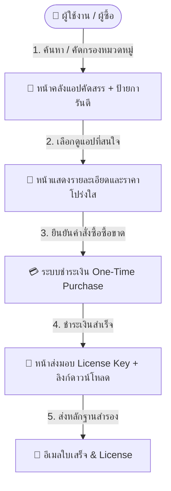
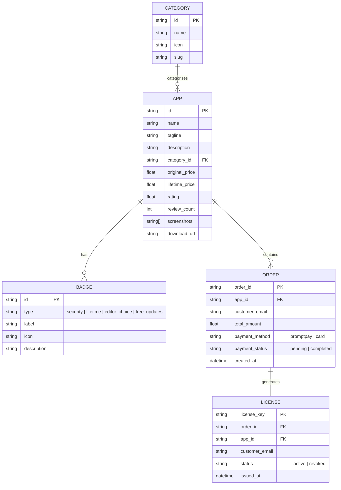

# 📑 Software Requirements Specification (SRS)
## ข้อกำหนดความต้องการของระบบ: แพลตฟอร์มคลังแอปพลิเคชันคัดสรรแบบซื้อขาด (Curated Lifetime App Store)
**โครงการ: MVP กลุ่ม 2**

---

### ข้อมูลเอกสาร (Document Control)
- **รหัสเอกสาร:** SRS-MVP2-001
- **เวอร์ชัน:** 1.0.0
- **วันที่:** 16 สิงหาคม 2026
- **สถานะ:** เสนออนุมัติ (Proposed Baseline)
- **ผู้จัดทำ:** ทีมพัฒนาโครงการกลุ่ม 2 (MVP Group 2)
- **เอกสารอ้างอิง:** [Project Charter (PC-MVP2-001)](file:///C:/Users/WIN10/docs/project_charter.md)

---

## 1. บทนำ (Introduction)

### 1.1 วัตถุประสงค์ของเอกสาร (Purpose)
เอกสารข้อกำหนดความต้องการของระบบ (Software Requirements Specification - SRS) ฉบับนี้จัดทำขึ้นเพื่อระบุข้อกำหนดเชิงหน้าที่ (Functional Requirements) และข้อกำหนดที่มิใช่เชิงหน้าที่ (Non-Functional Requirements) อย่างละเอียดสำหรับ **โครงการ MVP กลุ่ม 2: แพลตฟอร์มคลังแอปพลิเคชันคัดสรรแบบซื้อขาด** เพื่อใช้เป็นมาตรฐานอ้างอิงในการออกแบบ พัฒนา ทดสอบ และส่งมอบระบบ

### 1.2 ขอบเขตของระบบ (Scope of the System)
ระบบนี้เป็นเว็บแอปพลิเคชันตลาดกลาง (Marketplace Platform) ที่รวบรวมแอปพลิเคชันคุณภาพสูงซึ่งผ่านการตรวจสอบและติดป้ายการันตี โดยมีจุดเด่นคือการจำหน่ายแบบ **"ซื้อขาด (One-Time Purchase / Lifetime License)"** ผู้ซื้อจ่ายเงินเพียงครั้งเดียว ได้รับสิทธิ์ใช้งานตลอดชีพ ไม่ต้องแบกรับภาระค่าบริการรายเดือน พร้อมการแสดงราคาที่โปร่งใส ชัดเจน และไม่มีค่าใช้จ่ายแอบแฝง

### 1.3 คำจำกัดความและคำย่อ (Definitions & Acronyms)
| คำศัพท์ / คำย่อ | คำอธิบาย |
|---|---|
| **MVP** | Minimum Viable Product (ผลิตภัณฑ์ขั้นต่ำที่พร้อมส่งมอบคุณค่าหลักแก่ผู้ใช้) |
| **Lifetime License** | สิทธิ์การใช้งานซอฟต์แวร์ตลอดชีพโดยจ่ายเงินเพียงครั้งเดียว |
| **Guarantee Badge** | ตราสัญลักษณ์รับรองคุณภาพและความปลอดภัยที่ผ่านการตรวจสอบโดยทีมงาน |
| **Transparent Pricing** | การแสดงราคาสุทธิ พร้อมแจกแจงสิ่งที่ผู้ใช้จะได้รับอย่างตรงไปตรงมา |
| **Instant Fulfillment** | การส่งมอบ License Key และลิงก์ดาวน์โหลดทันทีหลังชำระเงินสำเร็จ |
| **PromptPay** | ระบบการชำระเงินอิเล็กทรอนิกส์ผ่าน QR Code ของประเทศไทย |

---

## 2. ภาพรวมของระบบ (Overall Description)

### 2.1 มุมมองสถาปัตยกรรมและกระบวนการทำงานหลัก (System Architecture & Workflow)



### 2.2 กลุ่มผู้ใช้งานเป้าหมาย (User Personas)
1. **ผู้บริโภคทั่วไปและคนทำงาน (General Consumers & Professionals):** ผู้ที่ต้องการโปรแกรมเครื่องมือใช้งานประจำวัน แต่ไม่ต้องการจ่ายรายเดือนซ้ำซ้อน
2. **นักพัฒนาและดิจิทัลครีเอเตอร์ (Developers & Creators):** ผู้ที่มองหา Developer Tools, Utility Apps คุณภาพสูงที่ผ่านการรับรองความปลอดภัย
3. **ผู้ดูแลระบบ (Admin / Group 2 Team):** ทีมงานผู้ทำหน้าที่คัดกรองแอป นำเข้าข้อมูล และตรวจสอบสถานะคำสั่งซื้อ

### 2.3 ข้อจำกัดของระบบในระยะ MVP (Constraints & Assumptions)
- ระบบเน้นการซื้อขายแอปพลิเคชันแบบ **ซื้อขาด (One-Time Payment)** เท่านั้น (ไม่รองรับโมเดล Subscription)
- ในระยะ MVP การลงรายการแอปจะดำเนินการโดยทีมงานกลุ่ม 2 เพื่อควบคุมมาตรฐานคุณภาพและความปลอดภัย

---

## 3. ความต้องการเชิงหน้าที่โดยละเอียด (Functional Requirements)

```
┌────────────────────────────────────────────────────────────────────────────┐
│                  โครงสร้างความต้องการเชิงหน้าที่ (Functional Scope)            │
├────────────────────────────────┬───────────────────────────────────────────┤
│ FR-1: คลังแอปคัดสรร + การันตี   │ FR-2: ระบบคัดกรองและค้นหา                 │
│ - แสดงการ์ดแอปพร้อมสัญลักษณ์   │ - Filter ตามประเภท/หมวดหมู่               │
│ - ป้ายการันตี 4 ระดับ           │ - ค้นหา Real-time & Multi-filter          │
├────────────────────────────────┼───────────────────────────────────────────┤
│ FR-3: หน้ารายละเอียด & ราคา    │ FR-4: ระบบชำระเงินซื้อขาด & ออก License    │
│ - แสดงฟีเจอร์, สเปก, ภาพตัวอย่าง│ - ช่องทางชำระเงินโปร่งใส (PromptPay/Card) │
│ - ตารางราคาซื้อขาดโปร่งใส      │ - ส่งมอบ License Key และตัวติดตั้งทันที   │
└────────────────────────────────┴───────────────────────────────────────────┘
```

---

### 🌟 FR-1: โมดูลคลังแอปคัดสรรและป้ายการันตี (Curated Catalog & Guarantee Badges)

| รหัสข้อกำหนด | รายละเอียดความต้องการ (Specification) | ระดับความสำคัญ |
|---|---|---|
| **FR-1.1** | **การแสดงผลการ์ดแอปพลิเคชัน (App Card Display):**<br>- แสดงไอคอนแอป, ชื่อแอป, สโลแกนสั้น, ผู้พัฒนา<br>- แสดงคะแนนรีวิวเฉลี่ย (Rating Stars) และจำนวนผู้รีวิว<br>- แสดงราคาซื้อขาดสุทธิ (Net Price) พร้อมป้ายระบุ "ซื้อครั้งเดียวจบ (Lifetime)" | **Must Have** |
| **FR-1.2** | **ระบบป้ายการันตี (Trust & Guarantee Badges Engine):**<br>ระบบต้องแสดงป้ายรับรองความน่าเชื่อถืออย่างชัดเจนบนการ์ดแอปและหน้ารายละเอียด ได้แก่:<br>1. 🛡️ **Security Verified:** ผ่านการสแกนความปลอดภัย ปลอดมัลแวร์ 100%<br>2. ⚡ **Lifetime Guarantee:** รับประกันสิทธิ์การใช้งานตลอดชีพ ไม่มีหมดอายุ<br>3. 🏆 **Editor's Choice:** แอปยอดเยี่ยมผ่านการคัดสรรโดยทีมผู้เชี่ยวชาญ<br>4. 🔄 **Free Updates Included:** อัปเดตแพตช์และฟีเจอร์เวอร์ชันถัดไปฟรี | **Must Have** |
| **FR-1.3** | **การเน้นแอปเด่นประจำสัปดาห์ (Featured / Hero Banner):**<br>มีส่วน Hero Showcase ด้านบนสุดของหน้าเพื่อแนะนำแอปคัดสรรพิเศษ พร้อมป้าย Highlight การันตี | **Should Have** |
| **FR-1.4** | **การแสดงสถานะโปรโมชันราคาซื้อขาด (Deal / Discount Badge):**<br>แสดงราคาเดิมขีดฆ่าและเปอร์เซ็นต์ส่วนลด เช่น *ลด 30% ซื้อขาดตลอดชีพ* เพื่อจูงใจในการตัดสินใจซื้อ | **Should Have** |

---

### 🔍 FR-2: โมดูลระบบคัดกรองและค้นหาประเภทแอป (Category & Smart Filtering)

| รหัสข้อกำหนด | รายละเอียดความต้องการ (Specification) | ระดับความสำคัญ |
|---|---|---|
| **FR-2.1** | **การคัดกรองตามหมวดหมู่หลัก (Category Navigation):**<br>ผู้ใช้สามารถเลือกคลิกแท็บหรือเมนูหมวดหมู่เพื่อแสดงแอปเฉพาะกลุ่ม ได้แก่:<br>- 💼 **Productivity & Work** (เครื่องมือจัดการงานและเอกสาร)<br>- 💻 **Developer Tools** (เครื่องมือสำหรับนักพัฒนาซอฟต์แวร์)<br>- 🎨 **Design & Media** (โปรแกรมกราฟิก แต่งภาพ และวิดีโอ)<br>- ⚙️ **Utilities & System** (โปรแกรมปรับแต่งและดูแลระบบคอมพิวเตอร์)<br>- 📊 **Business & Finance** (เครื่องมือวิเคราะห์และบัญชีเบื้องต้น) | **Must Have** |
| **FR-2.2** | **ระบบค้นหาด่วนแบบทันที (Real-Time Search):**<br>มีช่องค้นหาที่กรองรายการแอปตามชื่อแอป, คำอธิบายสั้น หรือแท็ก (Tags) ทันทีที่ผู้ใช้พิมพ์ (Debounce 200ms) | **Must Have** |
| **FR-2.3** | **ระบบตัวกรองหลายมิติ (Multi-criteria Filter):**<br>ผู้ใช้สามารถเลือกตัวกรองเสริมร่วมกันได้:<br>- กรองตามประเภทป้ายการันตี (เช่น เลือกเฉพาะ Security Verified หรือ Editor's Choice)<br>- กรองตามช่วงราคา (เช่น ต่ำกว่า 500 บาท, 500-1,500 บาท, มากกว่า 1,500 บาท)<br>- กรองตามคะแนนรีวิว (4 ดาวขึ้นไป) | **Must Have** |
| **FR-2.4** | **การจัดเรียงลำดับ (Sorting Mechanism):**<br>ผู้ใช้สามารถจัดเรียงรายการแอปตาม:<br>- ยอดนิยมสูงสุด (Most Popular)<br>- มาใหม่ล่าสุด (Newest Releases)<br>- ราคา: จากต่ำไปสูง (Price: Low to High)<br>- ราคา: จากสูงไปต่ำ (Price: High to Low) | **Should Have** |
| **FR-2.5** | **ระบบล้างตัวกรอง (Reset Filter):**<br>มีปุ่มสำหรับคืนค่าตัวกรองทั้งหมดกลับสู่สถานะเริ่มต้นได้ในคลิกเดียว | **Could Have** |

---

### 📄 FR-3: โมดูลหน้ารายละเอียดและราคาโปร่งใส (App Detail & Transparent Pricing)

| รหัสข้อกำหนด | รายละเอียดความต้องการ (Specification) | ระดับความสำคัญ |
|---|---|---|
| **FR-3.1** | **ข้อมูลรายละเอียดเชิงลึกและสื่อตัวอย่าง (Rich Media & Content):**<br>- แกลเลอรีภาพหน้าจอและวิดีโอตัวอย่างการใช้งาน (Screenshots & Video Demo)<br>- รายละเอียดคำอธิบายฟังก์ชันการทำงานฉบับสมบูรณ์<br>- ความต้องการของระบบ (System Requirements: OS, RAM, Storage) | **Must Have** |
| **FR-3.2** | **กล่องราคาซื้อขาดแบบโปร่งใส (Transparent Pricing Card):**<br>- ระบุราคาซื้อขาดสุทธิ (Net Total Price) ชัดเจน ไม่มีดอกจันซ่อนเงื่อนไข<br>- แสดงรายการสิ่งที่รวมอยู่ในแพ็กเกจ (What's Included List):<br>&nbsp;&nbsp;✔ ได้รับ License Key ใช้งานได้ถาวร (Lifetime Validity)<br>&nbsp;&nbsp;✔ อัปเดตฟีเจอร์และ Patch ความปลอดภัยฟรีตลอดชีพ<br>&nbsp;&nbsp;✔ รองรับการติดตั้งบนเครื่องหลัก (เช่น สูงสุด 2 เครื่องต่อ 1 สิทธิ์)<br>&nbsp;&nbsp;✔ บริการช่วยเหลือทางเทคนิค (Standard Support)<br>- แสดงข้อความยืนยัน: *"ไม่มีค่าบริการรายเดือน ไม่มีค่าธรรมเนียมแอบแฝง"* | **Must Have** |
| **FR-3.3** | **การเปรียบเทียบความคุ้มค่า (Lifetime Value / ROI Calculator):**<br>มีกราฟิก/ตารางเปรียบเทียบความคุ้มค่าระหว่างการจ่ายซื้อขาดครั้งเดียว กับการจ่ายรายเดือนในระยะยาว (เช่น จ่ายซื้อขาด 1 ครั้ง = ประหยัดได้กว่า 70% เมื่อเทียบกับรายเดือน 2 ปี) | **Should Have** |
| **FR-3.4** | **นโยบายการรับประกันและข้อตกลง (Guarantee Policy & FAQ):**<br>- แสดงนโยบายรับประกันความพึงพอใจและเงื่อนไขการคืนเงินภายใน 14 วัน<br>- ส่วนคำถามที่พบบ่อย (FAQ) เช่น วิธีเปิดใช้งาน License, การย้ายเครื่อง | **Must Have** |

---

### 💳 FR-4: โมดูลระบบสั่งซื้อและชำระเงินซื้อขาด (One-Time Purchase & Instant License)

| รหัสข้อกำหนด | รายละเอียดความต้องการ (Specification) | ระดับความสำคัญ |
|---|---|---|
| **FR-4.1** | **กระบวนการสั่งซื้อด่วน (Express Checkout Flow):**<br>ผู้ใช้คลิกปุ่ม *"ซื้อขาดทันที (Buy Lifetime License)"* เพื่อเข้าสู่หน้าสรุปรายการสั่งซื้อที่กระชับ โดยไม่ต้องผ่านขั้นตอนสมัครสมาชิกที่ยุ่งยาก | **Must Have** |
| **FR-4.2** | **การระบุข้อมูลผู้ซื้อ (Customer Identity):**<br>ผู้ใช้กรอกเพียง **อีเมล (Email Address)** และ **ชื่อผู้ใช้งาน** เพื่อใช้เป็นข้อมูลผูกกับ License Key และรับใบเสร็จ | **Must Have** |
| **FR-4.3** | **ช่องทางการชำระเงินที่โปร่งใสและปลอดภัย (Payment Options):**<br>- รองรับการชำระเงินผ่าน **QR Code พร้อมเพย์ (PromptPay)**<br>- รองรับการชำระเงินผ่าน **บัตรเครดิต/เดบิต (Credit/Debit Card)**<br>- แสดงยอดเงินที่ต้องชำระสุทธิตรงตามที่ระบุไว้ในหน้ารายละเอียด 100% | **Must Have** |
| **FR-4.4** | **การส่งมอบ License และลิงก์ดาวน์โหลดทันที (Instant Fulfillment):**<br>เมื่อการชำระเงินได้รับการยืนยันสำเร็จ ระบบต้องเปลี่ยนหน้าสู่ Success Page ทันทีพร้อมแสดง:<br>- รหัสสิทธิ์การใช้งาน (Unique Lifetime License Key)<br>- ปุ่มคลิกคัดลอก License Key (Copy to Clipboard)<br>- ปุ่มดาวน์โหลดไฟล์ติดตั้งโปรแกรม (Direct Download Link)<br>- คู่มือขั้นตอนการเปิดใช้งาน (Activation Guide) | **Must Have** |
| **FR-4.5** | **การส่งอีเมลยืนยันคำสั่งซื้อ (Email Confirmation & Receipt):**<br>ระบบส่งอีเมลสรุปใบเสร็จรับเงิน, รหัส License Key และลิงก์ดาวน์โหลดสำรองไปยังอีเมลของผู้ซื้อโดยอัตโนมัติ | **Must Have** |

---

## 4. ความต้องการที่มิใช่เชิงหน้าที่ (Non-Functional Requirements: NFR)

### 4.1 ด้านประสิทธิภาพและความเร็ว (Performance)
- **NFR-1.1:** เวลาในการโหลดหน้าแรก (First Contentful Paint) ต้องไม่เกิน 1.2 วินาที บนเครือข่ายความเร็วปกติ
- **NFR-1.2:** ระบบค้นหาและคัดกรองหมวดหมู่ต้องแสดงผลลัพธ์ภายในเวลาไม่เกิน 200 มิลลิวินาที (Real-Time Filter Response)
- **NFR-1.3:** ระบบสามารถรองรับผู้ใช้งานพร้อมกัน (Concurrent Users) ได้อย่างน้อย 100 ผู้ใช้ในระยะ MVP

### 4.2 ด้านความปลอดภัยและความโปร่งใส (Security & Privacy)
- **NFR-2.1:** การสื่อสารข้อมูลทั้งหมดในระบบต้องทำงานผ่านโปรโตคอล **HTTPS (TLS 1.3)**
- **NFR-2.2:** ระบบต้องไม่มีการจัดเก็บข้อมูลบัตรเครดิตของผู้ใช้ไว้ในเซิร์ฟเวอร์โดยตรง (ใช้ Payment Gateway Tokenization)
- **NFR-2.3:** License Key ต้องสร้างด้วยอัลกอริทึมเข้ารหัสเฉพาะ (Cryptographically Secure Pseudo-Random Generator) เพื่อป้องกันการปลอมแปลง

### 4.3 ด้านการออกแบบและประสบการณ์ผู้ใช้ (Usability & Design)
- **NFR-3.1:** รองรับการแสดงผลแบบ **Responsive Web Design** อย่างสมบูรณ์ทั้งบนมือถือ (Mobile), แท็บเล็ต (Tablet) และคอมพิวเตอร์ (Desktop)
- **NFR-3.2:** ใช้โทนสีและ Typography ที่สะท้อนความน่าเชื่อถือ โปร่งใส (Clean, Trustworthy, Modern) มีสัญลักษณ์ป้ายการันตีที่มองเห็นเด่นชัด
- **NFR-3.3:** มาตรฐานความคมชัดของสีข้อความ (Color Contrast Ratio) ต้องผ่านเกณฑ์ **WCAG 2.1 ระดับ AA** เพื่อให้อ่านง่าย

---

## 5. แผนผังกระบวนการใช้งานหลัก (Key User Flow & Scenarios)

### User Scenario 1: การเลือกหาแอปและตรวจสอบป้ายการันตี
```
[ผู้ใช้เข้าสู่หน้าแรก] 
       │
       ▼
[เลือกหมวดหมู่ เช่น 'Productivity'] ──► [ติ๊กเลือกป้าย 'Security Verified' และ 'Lifetime Guarantee']
       │
       ▼
[แสดงรายการแอปที่ผ่านเงื่อนไขการันตี] ──► [คลิกการ์ดแอปเพื่อดูรายละเอียด]
```

### User Scenario 2: การตรวจสอบราคาและความโปร่งใส และทำการสั่งซื้อซื้อขาด
```
[เข้าสู่หน้า App Detail]
       │
       ▼
[ตรวจสอบวิดีโอตัวอย่าง, ฟีเจอร์ที่ได้รับ และตารางราคาซื้อขาดที่ไม่มีค่าธรรมเนียมแอบแฝง]
       │
       ▼
[กดปุ่ม 'ซื้อขาดทันที' (One-Time Purchase)] 
       │
       ▼
[กรอกอีเมล ──► เลือกจ่ายผ่าน QR PromptPay / บัตรเครดิต ──► ยืนยันชำระเงิน]
       │
       ▼
[รับ License Key + ลิงก์ดาวน์โหลดทันทีบนหน้าจอ และรับอีเมลสำรอง]
```

---

## 6. โครงสร้างข้อมูลพื้นฐานสำหรับระยะ MVP (Data Schema & Entities)



---

## 7. เกณฑ์การยอมรับและการทดสอบระบบ (Acceptance Criteria & QA Matrix)

| รหัสทดสอบ | เงื่อนไขการทดสอบ (Test Scenario) | ผลลัพธ์ที่คาดหวัง (Expected Result) | สถานะผ่านเกณฑ์ |
|---|---|---|---|
| **TC-01** | ตรวจสอบการแสดงผลคลังแอปและป้ายการันตี | การ์ดแอปแสดงไอคอน, ข้อมูล, ราคาซื้อขาด และป้ายการันตี 4 รูปแบบอย่างถูกต้อง | [ ] Pass |
| **TC-02** | ทดสอบการคัดกรองหมวดหมู่และการค้นหา | เมื่อเลือกหมวดหมู่หรือพิมพ์ชื่อแอป ระบบแสดงเฉพาะแอปที่ตรงเงื่อนไขแบบ Real-time | [ ] Pass |
| **TC-03** | ตรวจสอบหน้ารายละเอียดและตารางราคา | แสดงรายการฟีเจอร์ สเปกเครื่อง และราคาสุทธิโดยไม่มีข้อความซ่อนเร้นหรือค่าแอบแฝง | [ ] Pass |
| **TC-04** | ทดสอบกระบวนการชำระเงิน One-Time Purchase | ผู้ใช้กรอกอีเมลและเลือกชำระเงิน ระบบทำรายการสำเร็จและเปลี่ยนสถานะเป็น Completed | [ ] Pass |
| **TC-05** | ตรวจสอบการส่งมอบ License Key ทันที | หน้า Success แสดง License Key ที่สามารถคลิกคัดลอกได้ และปุ่มดาวน์โหลดไฟล์ใช้งานได้จริง | [ ] Pass |
| **TC-06** | ทดสอบการใช้งานบนอุปกรณ์ขนาดหน้าจอต่างๆ | หน้าเว็บแสดงผลได้สวยงาม ไม่ล้นจอ และใช้งานปุ่มกดได้สะดวกทั้งบน Mobile และ Desktop | [ ] Pass |

---

## 8. การลงนามรับรองข้อกำหนด (Requirements Sign-off)

| ตัวแทนกลุ่ม | ตำแหน่ง | วันที่ | ลายมือชื่อ |
|---|---|---|---|
| **หัวหน้าทีมพัฒนา (Group 2 Lead)** | Lead Developer & Product Owner | ____/____/________ | ____________________ |
| **หัวหน้าทีมระบบชำระเงินและสถาปัตยกรรม** | System Architect | ____/____/________ | ____________________ |
